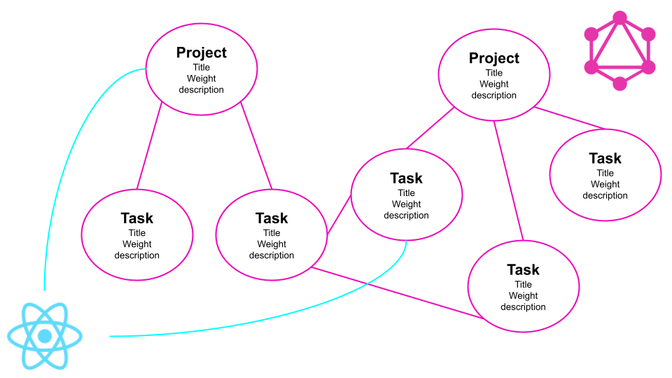

# GraphQL API



## Learning Objectives
At the end of this project, you are expected to be able to explain to anyone, without the help of Google:

- What **_GraphQL_** means
- What is **_Graphiql_**
- How to test queries using **_Graphiql_**
- What is **_Apollo_**
- How to connect to **_MongoDB_**
- How to make queries from **_React_**
- How to make **_GraphQL_** server accept request from another server

## Requirements
- Allowed editors: `vi, vim, emacs, Visual Studio Code`
- All your files will be interpreted/compiled on `Ubuntu 18.04 LTS` using `node` (`version 12.x.x`)
- All your files should end with a new line
- A `README.md` file, at the root of the folder of the project, is mandatory
- Your code should use the js extension

### Setup
Install NodeJS
(in your home directory):

```sudo apt install nodejs 
$ node -v
v12.x.x
$ npm -v
...
```
### Setup Express and GraphQL
In your folder server of GraphQL server:

- Add package.json using: `npm init`
- Install **_Express_** in the directory and save it in the dependencies list using: ```npm install express --save```
- Set up **_GraphQL_** using: `npm install graphql express-graphql`
- Setup **_Apollo_**
`npm i apollo-boost graphql react-apollo --save`